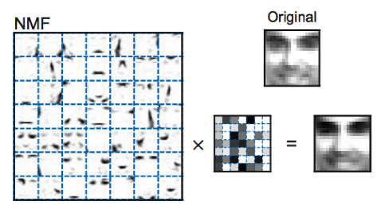
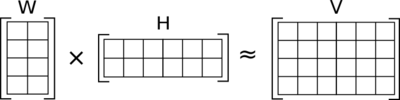
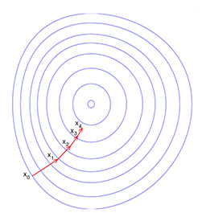
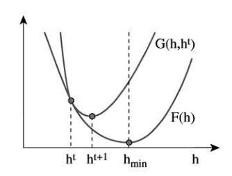

Algorithms for Non-negative Matrix Factorization
================================================

----

content
=======

Introduction
------------

Non-negative matrix factorization
---------------------------------

Cost functions
--------------

Multiplicative update rules
---------------------------

Multiplicative  versus  additive update rules
---------------------------------------------

Proofs of convergence
---------------------

Discussion
----------

----

Introduction
============

**Daniel D. Lee** Bell Laboratories Lucent Technologies.

**H. Sebastian Seung** Dept.of Brain and Cog. Sci. Massachusetts Institute of Technology Cambridge

 

----

Introduction
============

**Non-negative matrix factorization (NMF)**

- Nonnegativity is useful constraint for matrix factorization that can learn a parts representation of the data.

- Sparse combinations to generate expressiveness in the reconstructions

----

Non-negative matrix factorization
=================================

**Non-negative matrix factorization (NMF)**: Given a non-negative matrix $V$, find non-negative matrix factors $W$ and $H$ such that:

$$
V \\approx{WH}
$$

- $V$ is an $n\\times m$ matrix: $m$ examples, $n$ features.
- $W_{n\\times r}$, $H_{r\\times m}$, where $r\\lt m, r\\lt n$. **Compressed** !
- $v_{\*j}\\approx{Wh_{\*j}}$, $v$ is approximated by a linear combination of the columns of $W$, weighted by the components of $h$.

**How to find**: NP-hard. Alternating iterative method.

Two algorithms will be discussed.

----

Cost functions
==============

1.  Euclidean distance
$$\\Arrowvert A-B\\Arrowvert^2=\\Sigma_{ij}(A_{ij}-B_{ij})^2$$

lower bounded by zero, vanishes if $A=B$

2. Divergence 
$$D(A\\Arrowvert B)=\\Sigma_{ij}(A_{ij}\\log\\frac{A_{ij}}{B_{ij}}-A_{ij}+B_{ij})$$

- lower bounded by zero.
- not symmetric, not distance.
- reduces to the Kullback-Leibler divergence when $\\Sigma_{ij}A_{ij}=\\Sigma_{ij}B_{ij}=1$

**Kullback-Leibler divergence(relative entropy)**

$$D(p\\Arrowvert q)=\\Sigma_{i=1}^np(x)\\log\\frac{p(x)}{q(x)}$$

----

Cost functions
==============

**Problem1** Minimize $\\Arrowvert V-WH \\Arrowvert^2$ with respect to $W$ and $H$, subject to the constraints $W,H\\geq 0$.

**Problem2** Minimize $D(A\\Arrowvert B)$ with respect to $W$ and $H$, subject to the constraints $W,H\\geq 0$.

Gradient descent 
----------------

----

Multiplicative update rules
===========================

**Theorem 1** The Euclidean distance $\\Arrowvert V-WH\\Arrowvert$  is nonincreasing under the update rules

$$
\\begin{array}{cc}
H_{a\\mu}\\leftarrow H_{a\\mu}\\frac{(W^{T}V_{a\\mu})}{(W^{T}WH)_{a\\mu}} & W_{ia}\\leftarrow W_{ia}\\frac{(VH^T)_{ia}}{(WHH^T)_{ia}}
\\end{array}
$$

invariant if and only if $W$ and $H$ are at a stationary point of  the distance.

**Theorem 2** The divergence $D(A\\Arrowvert B)$ is nonincreasing under the update rules

$$
\\begin{array}{cc}
H_{au}\\leftarrow\\frac{\\Sigma_i W_{ia}V_{i\\mu}/(WH)_{i\\mu}}{\\Sigma_k W_{ka}} & W_{ia}\\leftarrow W_{ia}\\frac{\\Sigma_{\\mu}H_{a\\mu}V_{i\\mu}/(WH)_{i\\mu}}{\\Sigma_{v}H_{av}}
\\end{array}
$$

invariant if and only if $W$ and $H$ are at a stationary point of  the distance.

multiplicative factor is unity when $V=WH$, so that perfect reconstruction is necessarily a fixed point of the update rules.

----

Multiplicative  versus  additive update rules
=============================================

Gradient descent

1. Euclidean distance
$$\\begin{array}{c}
H_{a\\mu}\\leftarrow+\\eta_{a\\mu}[(W^TV)_{a\\mu}-(W^TWH)_{a\\mu}]  \\textrm{  set: } \\eta_{a\\mu}=\\frac{H_{a\\mu}}{(W^TWH)_{a\\mu}}\\\\
\\Downarrow \\\\ 
H_{a\\mu}\\leftarrow H_{a\\mu}\\frac{(W^{T}V_{a\\mu})}{(W^{T}WH)_{a\\mu}}\\textrm{(in Theory 1)}
\\end{array}
$$

2.Divergence
$$\\begin{array}{c}
H_{a\\mu}\\leftarrow+\\eta_{a\\mu}[\\Sigma_iW_{ia}\\frac{V_{i\\mu}}{(WH)_{i\\mu}-\\Sigma_iW_{ia}}]  \\textrm{  set: } \\eta_{a\\mu}=\\frac{H_{a\\mu}}{\\Sigma_iW_{ia}}\\\\
\\Downarrow \\\\ 
H_{au}\\leftarrow\\frac{\\Sigma_i W_{ia}V_{i\\mu}/(WH)_{i\\mu}}{\\Sigma_k W_{ka}}\\textrm{(in Theory 2)}
\\end{array}
$$

----

Proofs of convergence
=====================

**Definition 1**  $G(h,h')$ is an auxiliary function for $F(h)$ if the conditions 
$$G(h,h')\\ge F(h),G(h,h)=F(h)$$
are satisfied.

**Lemma 1**  If $G$ is an auxiliary function, then $F$ is  nonincreasing under the update

$h^{t+1}=arg\\min_{h}G(h,h^t)$

Figure 1:  Minimizing the auxiliary function $G(h, h^t)\\ge F(h)$  guarantees that $F(h^{t+1})\\leq F(ht)$ for $h^{n+1}=arg\\min_h G(h, h^t)$.

----

Proofs of convergence
=====================

**Lemma 2**  If $K(h^t)$ is the diagonal matrix
$$K_{ab}(h^{t})=\\delta_{ab}(W^{T}Wh^{t})_{a}/h_{a}^{t}$$
then
$$G(h,h^t)=F(h^t)+(h-h^t)^T\\nabla F(h^t)+\\frac{1}{2}(h-h^t)^TK(h^t)(h-h^t)$$
is an auxiliary function for 
$$F(h)=\\frac{1}{2}\\Sigma_{i}(v_i-\\Sigma_a W_{ia}h_{a})^2$$

**Proof of Theorem 1**

$$h^{t+1}=h^t-K(h^T)-1\\nabla F(h^t)$$

$$h_a^{t+1}=h_a^t\\frac{(W^Tv)_a}{(W^TWh^t)_a}$$

reversing the roles of $W$ and $H$, $F$ can similarly be shown  to  be nonincreasing under the update rules for $W$. 

----

Proofs of convergence
=====================

**Lemma 3** Define 
$$\\begin{array}{ll}
G(h,h^t)=&\\Sigma_{i}(v_{i}\\log v_{i} - v_{i})+\\Sigma_{ia}W_{ia}h_{a}\\\\
&-\\Sigma_{ia}v_{i}\\frac{W_{ia}h_{a}^t}{\\Sigma_{b}W_{ib}h_b^t}(\\log W_{ia}h_{a}-\\log\\frac{W_{ia}h_{a}^t}{\\Sigma_bW_{ib}h_{b}^t})
\\end{array}$$

this is an auxiliary function for 
$$F(h)=\\Sigma_{i}v_{i}\\log(\\frac{v_{i}}{\\Sigma_aW_{ia}h_{a}})-v_{i}+\\Sigma_{a}W_{ia}h_{a}$$

**Proof of Theorem 2** The minimum of $G(h,h^t)$ with respect to $h$ is determined by setting the gradient to zero:

$$\\frac{dG(h,h^t)}{dh_a}=-\\Sigma_i v_i\\frac{W_{ia}h_a^t}{\\Sigma_bW_{ib}h_{b}^t}\\frac{1}{h_{a}}+\\Sigma_{i}W_{ia}=0$$

update rule:

$$
h_{a}^{t+1}=\\frac{h_a^t}{\\Sigma_bW_{kb}}\\Sigma_{i}\\frac{v_{i}}{\\Sigma_{b}W_{ib}h_{b}^t}W_{ia}
$$

Rewriten in matrix form, it is equivalent to the update rule.

----

Discussion
==========

- The update rules guaranteed to find **at least locally optimal solutions** of Problems 1 and 2.
- The convergence proofs rely upon **defining an appropriate auxiliary function**, more generalize?
- Easy  to  implement computationally, utilized  by  other applications?

----

Thank you!
==========